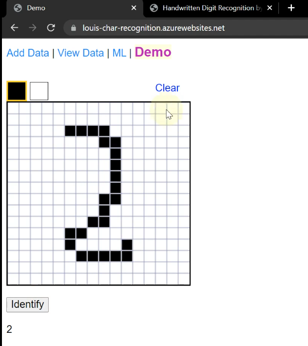
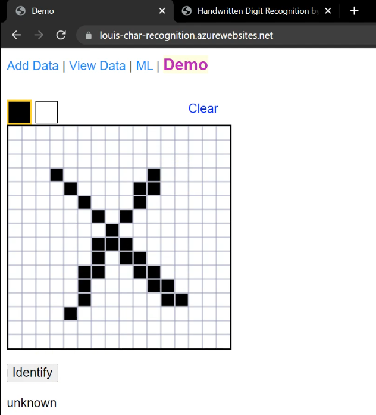
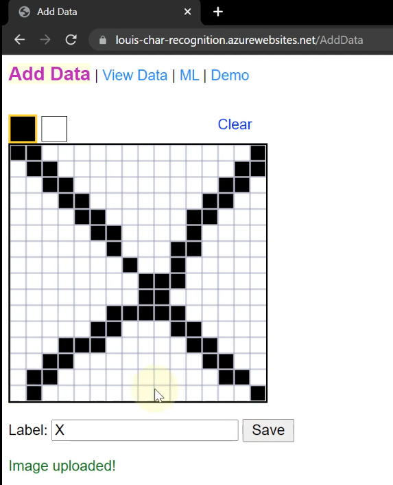
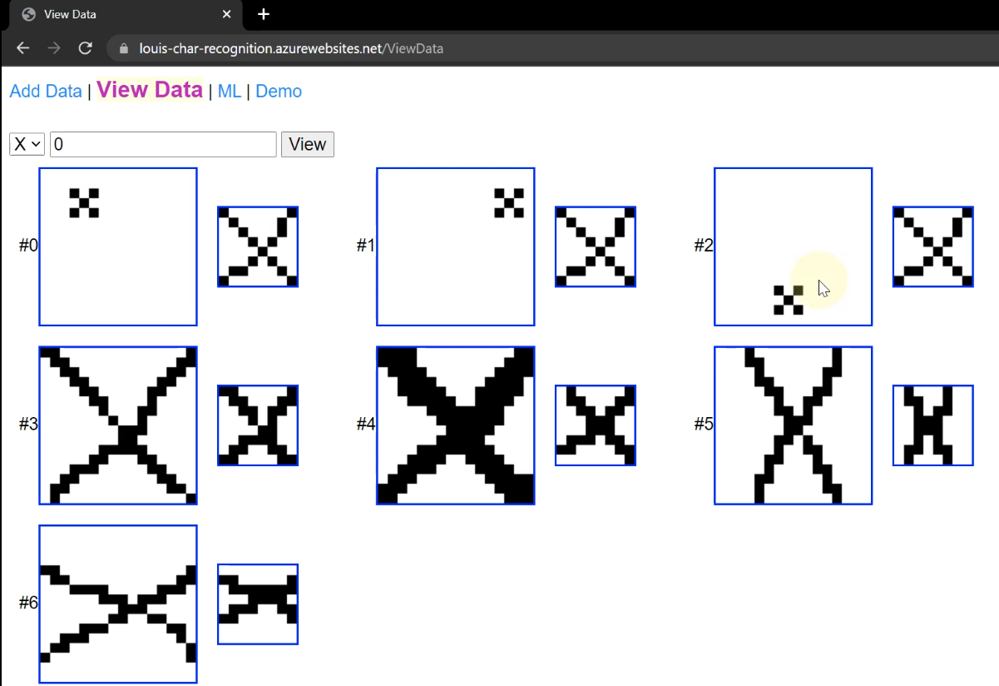
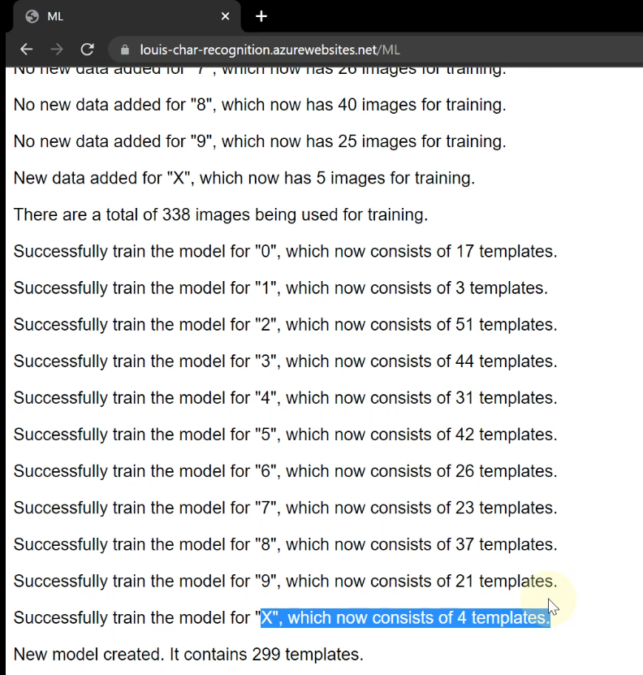
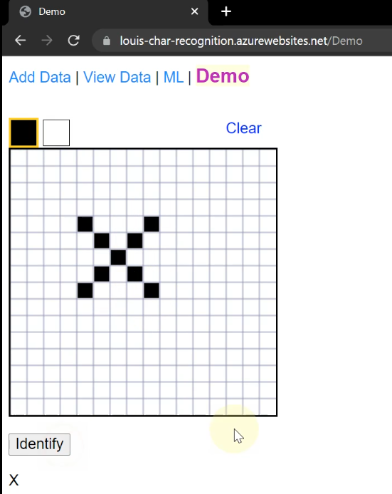

# Character Recognition using Template Matching

2021 December

**Platform**: C# (.Net 6), Azure

Using images from the MNIST dataset, the project can detect digits 0 ~ 9.

However, the letter "X" is not in the dataset, so the model rejects "X" as invalid input.

Add images of "X" to the dataset.

Then retrain the model.

After retraining, the model can detect X.

[YouTube Video Presentation](https://www.youtube.com/watch?v=_n6jJSM8K3o)

Documentation: /docs/char_recognition.docx

NuGet Dependencies:
* Newtonsoft.Json
* Microsoft.Net.Sdk.Functions
* Azure.Storage.Blobs

